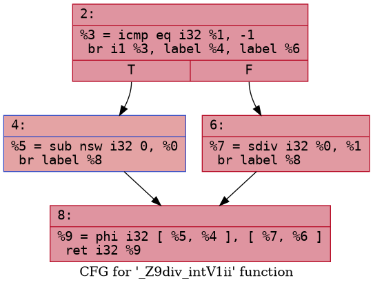
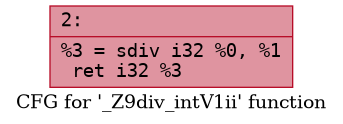
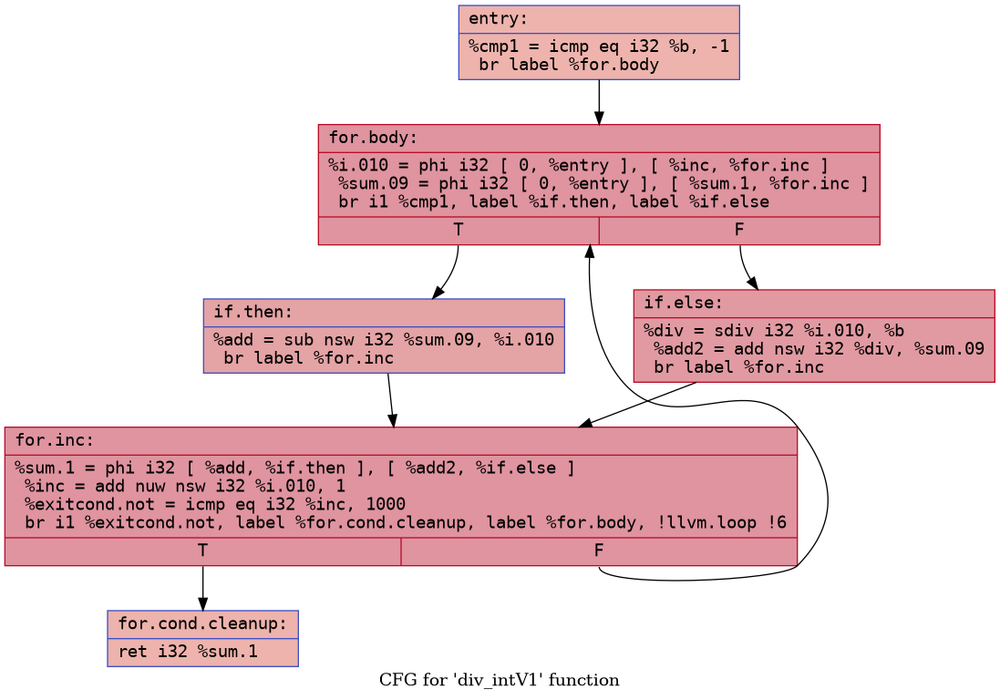
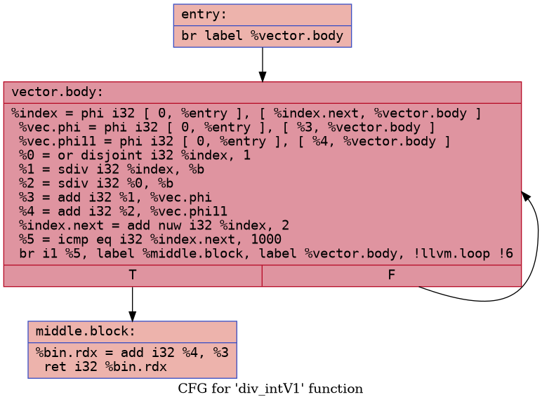
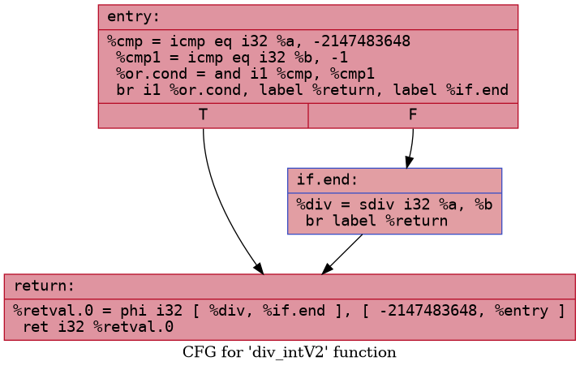
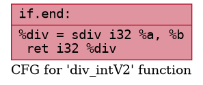

# SDiv instruction pass for arm machines

This is an example of code we want to optimize.

```c++
int div_intV1(int a, int b)
{
    if (b == -1)
    {
        return -a;
    }

    return a/b;
}
```

```c++
int div_intV2(int a, int b)
{
    if (a == -INT_MAX && b == -1)
    {
        return a;
    }

    return a/b;
}
```

On x86 machines it leads to UB if we divide `INT_MIN` by `-1` (floating point exception) and we have to check it.

But on arm machines there is no such behaviour, that's why there's an opportunity of optimization.

This is the code and CFG LLVM IR generates for `div_intV1`.
```llvm
  %3 = icmp eq i32 %1, -1
  br i1 %3, label %4, label %6

4:                                                ; preds = %2
  %5 = sub nsw i32 0, %0
  br label %8

6:                                                ; preds = %2
  %7 = sdiv i32 %0, %1
  br label %8

8:                                                ; preds = %6, %4
  %9 = phi i32 [ %5, %4 ], [ %7, %6 ]
  ret i32 %9
```


### Research
- First idea is to write a transforming pass and insert it at the end of the pass builder pipeline. Pass recognizes this pattern and changes it to the correct one.
- Pass code example is [here](/ArmSDivPass.cpp)

##### Some results

```llvm
  %3 = sdiv i32 %0, %1
  ret i32 %3
```


## Optimization Comparison for default example

Without pass       | With pass
---------------------------------- | ----------------------------------
 | 

Pass would go from the top of the tree, i realized that it is not a scalable strategy.
That's why in commit `5289d18` pass starts from the block with `sdiv` instructions and then goes through the rest of the blocks.

# UPD 1.1

Now the pass can simplify cycles like this:

```cpp
    int sum = 0;

    for (int i = 0; i < 1000; i++)
    {
      if (b == -1)
        sum += -i;
      else
          sum += i/b;
    }
    return sum;
```

## Optimization Comparison for cycles

Without pass       | With pass
---------------------------------- | ----------------------------------
 | 

---

# UPD 1.2

The pass can also simplify a pattern with `INT_MIN`

```cpp
extern "C" int div_intV2(int a, int b)
{
    if (a == -INT_MAX && b == -1)
    {
        return a;
    }

    return a/b;
}

```

Without pass       | With pass
---------------------------------- | ----------------------------------
 | 

---

### Tests

- Tests for this pass are located [here](./tests/div.cpp)

Send issues if you have some ideas on new tests, cuz now I got only 3 :(


### Additional info

```c++
int mul_intV1(int a, int b, int c)
{

    if (a == 237 && b == 436734)
    {
        return a * b;
    }

    return a * b;

}

```


LLVM- IR also can't generate this code correctly. Here is the result we get, using -O2 generation.

```asm
mul_intV1:
        mov     w8, #43674
        mul     w9, w1, w0
        cmp     w1, w8
        mov     w8, #237
        ccmp    w0, w8, #0, eq
        mov     w8, #61586
        movk    w8, #157, lsl #16
        csel    w0, w8, w9, eq
        ret
```

Instead it should generate

```
mul reg_a, reg_b
ret
```

These problems intersect in some way, so I decided to put it here.
