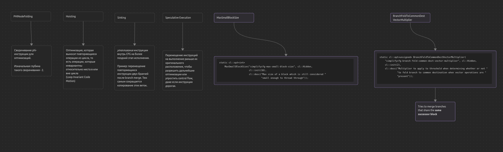
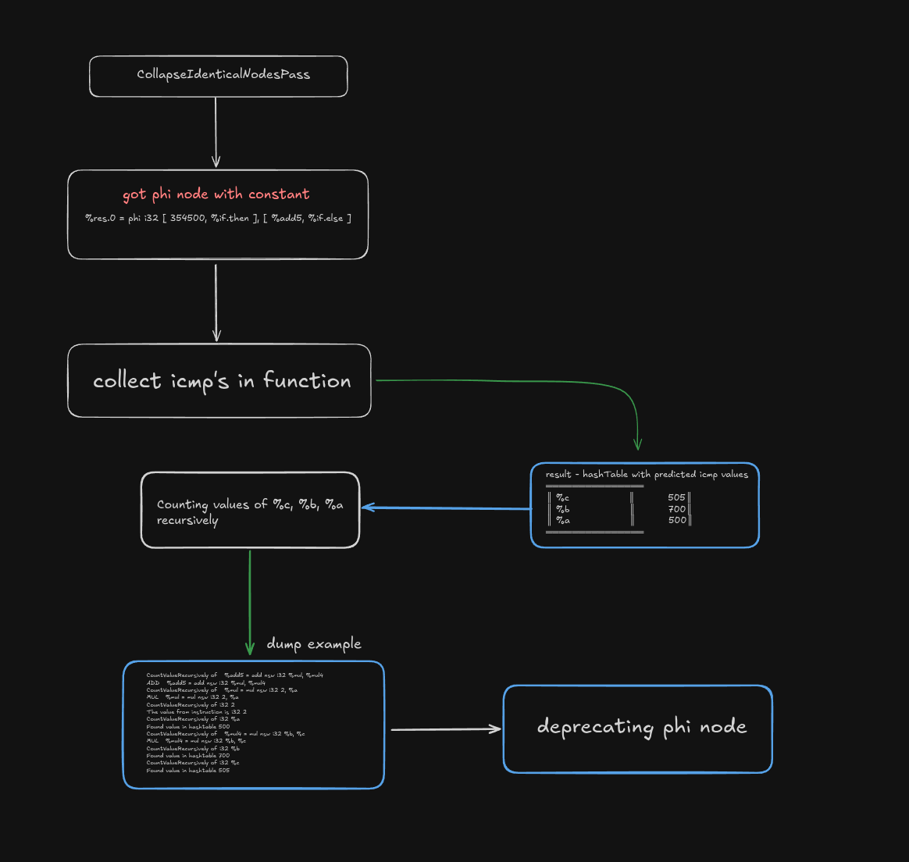

This is a research about this example ([previous part of the research](./SDivConvolution/README_old.md))

## Source code
```cpp
int test1(int a, int b, int c) {
	if (a == 46346 && b == 5745 && c == 5)
		return a * b / c;

return a * b / c;
}
```
## Compilation commands

compile it with `clang` using this command and then use `opt`:
```
clang++ -S -emit-llvm -O0 -Xclang -disable-O0-optnone mul.cpp -o mulb4.ll
```

```
opt -S -O2 mulb4.ll -o mulb4O2.ll -print-after-all &> mulb4_after_all.txt
```

## Current result

get this result at the end:
```cpp
define dso_local noundef i32 @_Z5test1iii(i32 noundef %a, i32 noundef %b, i32 noundef %c) local_unnamed_addr #0 {
entry:
  %cmp = icmp eq i32 %a, 46346
  %cmp1 = icmp eq i32 %b, 5745
  %or.cond = and i1 %cmp, %cmp1
  %cmp3 = icmp eq i32 %c, 5
  %or.cond1 = and i1 %or.cond, %cmp3
  br i1 %or.cond1, label %return, label %if.end

if.end:                                           ; preds = %entry
  %mul4 = mul nsw i32 %b, %a
  %div5 = sdiv i32 %mul4, %c
  br label %return

return:                                           ; preds = %entry, %if.end
  %retval.0 = phi i32 [ %div5, %if.end ], [ 53251554, %entry ]
  ret i32 %retval.0
}

```
## The result we actually want

instead we want to get this ->
```cpp
define dso_local noundef i32 @_Z5test1iii(i32 noundef %a, i32 noundef %b, i32 noundef %c) local_unnamed_addr #0 {

  %mul4 = mul nsw i32 %b, %a
  %div5 = sdiv i32 %mul4, %c
  ret i32 %div5
}

```

## Got first results!
- If we slightly change the start of `-O2` pipeline.

### How it was
```cpp
EarlyFPM.addPass(LowerExpectIntrinsicPass());
EarlyFPM.addPass(SimplifyCFGPass());
EarlyFPM.addPass(SROAPass(SROAOptions::ModifyCFG));
EarlyFPM.addPass(EarlyCSEPass());
```

### How it is now
```cpp
EarlyFPM.addPass(LowerExpectIntrinsicPass());
EarlyFPM.addPass(SimplifyCFGPass());
EarlyFPM.addPass(SROAPass(SROAOptions::ModifyCFG));
EarlyFPM.addPass(SimplifyCFGPass());
EarlyFPM.addPass(EarlyCSEPass());
EarlyFPM.addPass(InstCombinePass());
EarlyFPM.addPass(SimplifyCFGPass());
```

| Test number | Test            |
| ----------- | --------------- |
| 1           | [tap](./test1.md) |
| 2           | [tap](./test2.md) |
| 3           | [tap](./test3.md) |

In the next part of the research I tried to find tests that won't be optimized because of modified pass pipeline. I found those, you can find them [here](./MixedConstantsTests/)

```cpp
int mul_intV4(int a, int b, int c, int d) {

    int res;
    if (a == 500 && d == 700 && c == a + 5) {
        res = a * c * b + d;
    } else {
        res = a * b * c + d;
    }
    return res;
}
```

That's why I tried to modify SimplifyCFG inside.
It has some paramaters which can be modified, they are situated below.



It was decided to modify `MaxSmallBlockSize` and `BranchFoldToCommonDestVectorMultiplier`. It won't give any results though.

### CollapseIdenticalNodes Pass
It was decided to write a pass that would notice the pattern and optimize **IR** code.
<div style="text-align: center;">
  
  <p><em>CollapseIdenticalNodes pass structure.</em></p>
</div>

#### Current Result with this pass (-O2 flag)

###### Before
```llvm
define dso_local noundef i32 @foo(int, int, int, int)(i32 noundef %a, i32 noundef %b, i32 noundef %c, i32 noundef %d) local_unnamed_addr {
entry:
  %cmp = icmp eq i32 %a, 500
  %cmp1 = icmp eq i32 %b, 700
  %or.cond = and i1 %cmp, %cmp1
  %cmp3 = icmp eq i32 %c, 505
  %or.cond10 = and i1 %or.cond, %cmp3
  %mul = shl nsw i32 %a, 1
  %mul4 = mul nsw i32 %b, %b
  %add5 = add nsw i32 %mul4, %mul
  %res.0 = select i1 %or.cond10, i32 354500, i32 %add5
  ret i32 %res.0
}

```
###### After
```llvm
define dso_local noundef i32 @_Z3fooiiii(i32 noundef %a, i32 noundef %b, i32 noundef %c, i32 noundef %d) local_unnamed_addr #0 {
entry:
  %mul = shl nsw i32 %a, 1
  %mul4 = mul nsw i32 %c, %b
  %add5 = add nsw i32 %mul4, %mul
  ret i32 %add5
}
```


