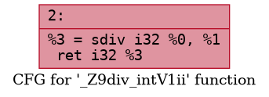

# SDiv instruction pass for arm machines

This is an example of code we want to optimize.

```c++
int div_intV1(int a, int b)
{
    if (b == -1)
    {
        return -a;
    }

    return a/b;
}
```

```c++
int div_intV2(int a, int b)
{
    if (a == -INT_MAX && b == -1)
    {
        return a;
    }

    return a/b;
}
```

On x86 machines it leads to UB if we divide `INT_MIN` by `-1` (floating point exception) and we have to check it.

But on arm machines there is no such behaviour, that's why there's an opportunity of optimization.

This is the code and CFG LLVM IR generates for `div_intV1`.
```llvm
  %3 = icmp eq i32 %1, -1
  br i1 %3, label %4, label %6

4:                                                ; preds = %2
  %5 = sub nsw i32 0, %0
  br label %8

6:                                                ; preds = %2
  %7 = sdiv i32 %0, %1
  br label %8

8:                                                ; preds = %6, %4
  %9 = phi i32 [ %5, %4 ], [ %7, %6 ]
  ret i32 %9
```


### Research
- First idea is to write a transforming pass and insert it at the end of the pass builder pipeline. Pass recognizes this pattern and changes it to the correct one.
- Pass code example is [here](/ArmSDivPass.cpp)

##### Some results

```llvm
  %3 = sdiv i32 %0, %1
  ret i32 %3
```




