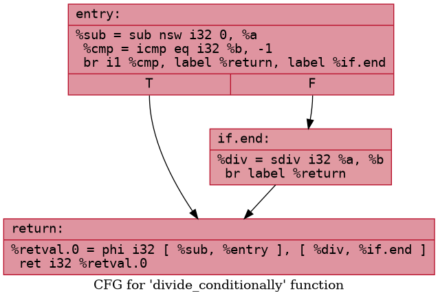
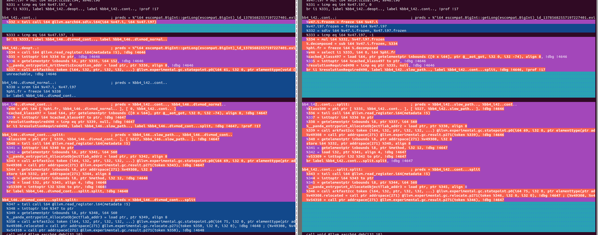
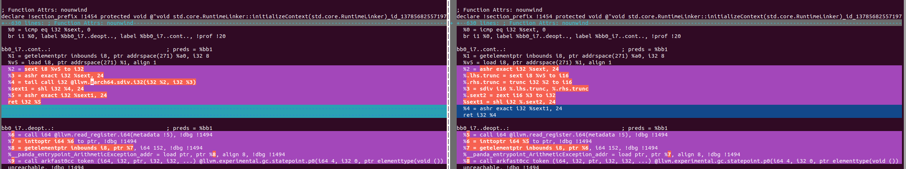
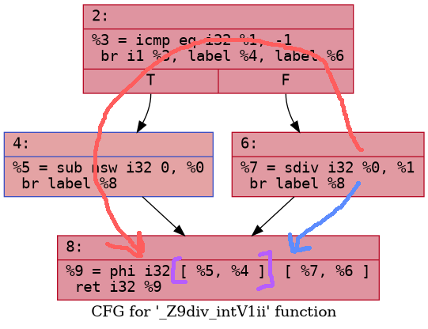
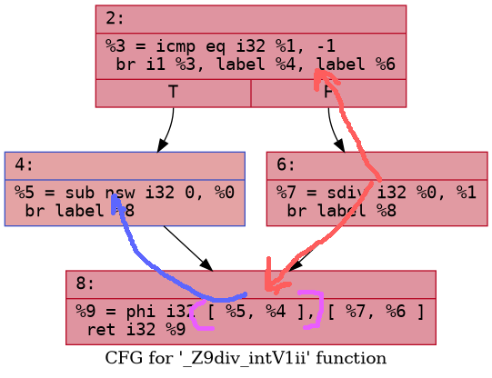
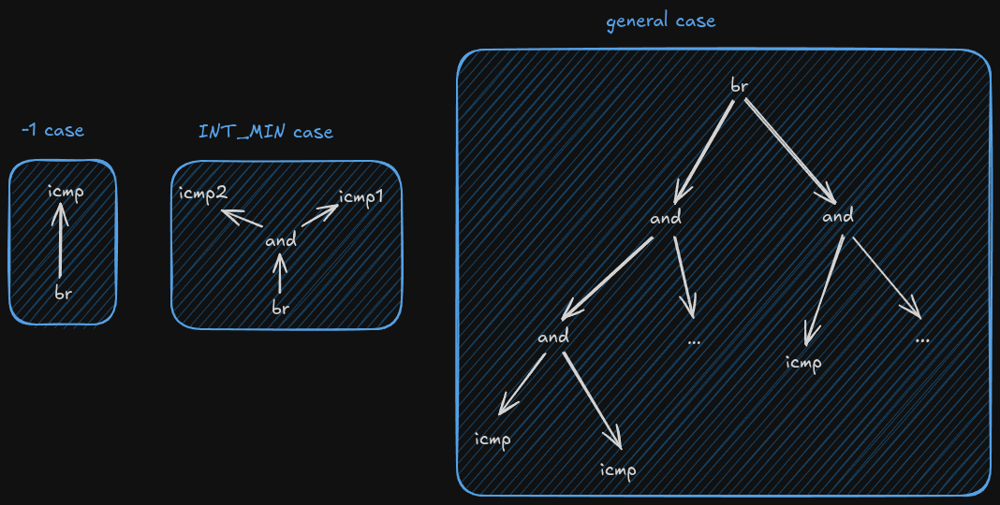

# SDiv instruction pass for arm machines

This is an example of code we want to optimize.

```c++
int div_intV1(int a, int b)
{
    if (b == -1)
    {
        return -a;
    }

    return a/b;
}
```

```c++
int div_intV2(int a, int b)
{
    if (a == -INT_MAX && b == -1)
    {
        return a;
    }

    return a/b;
}
```

On x86 machines it leads to UB if we divide `INT_MIN` by `-1` (floating point exception) and we have to check it.

But on arm machines there is no such behaviour, that's why there's an opportunity of optimization.

This is the code and CFG LLVM IR generates for `div_intV1`.
```llvm
  %3 = icmp eq i32 %1, -1
  br i1 %3, label %4, label %6

4:                                                ; preds = %2
  %5 = sub nsw i32 0, %0
  br label %8

6:                                                ; preds = %2
  %7 = sdiv i32 %0, %1
  br label %8

8:                                                ; preds = %6, %4
  %9 = phi i32 [ %5, %4 ], [ %7, %6 ]
  ret i32 %9
```


### Research
- First idea is to write a transforming pass and insert it at the end of the pass builder pipeline. Pass recognizes this pattern and changes it to the correct one.
- Pass code example is [here](/ArmSDivPass.cpp)

##### Some results

```llvm
  %3 = sdiv i32 %0, %1
  ret i32 %3
```


## Optimization Comparison for default example

Without pass       | With pass
---------------------------------- | ----------------------------------
 | 

Pass would go from the top of the tree, i realized that it is not a scalable strategy.
That's why in commit `5289d18` pass starts from the block with `sdiv` instructions and then goes through the rest of the blocks.

# UPD 1.1

Now the pass can simplify cycles like this:

```cpp
    int sum = 0;

    for (int i = 0; i < 1000; i++)
    {
      if (b == -1)
        sum += -i;
      else
          sum += i/b;
    }
    return sum;
```

## Optimization Comparison for cycles

Without pass       | With pass
---------------------------------- | ----------------------------------
 | 

---

# UPD 1.2

The pass can also simplify a pattern with `INT_MIN`

```cpp
extern "C" int div_intV2(int a, int b)
{
    if (a == -INT_MAX && b == -1)
    {
        return a;
    }

    return a/b;
}

```

Without pass       | With pass
---------------------------------- | ----------------------------------
 | 

---


# UPD 1.3

Now I have two branches in research.

1. Check if the pass works correctly with [ark](https://gitee.com/openharmony/arkcompiler_runtime_core/tree/OpenHarmony_feature_20250702/static_core)
2. Try to find out what is going on when sdiv block has two successors.


## First branch
We checked it and noticed wrong code-generation in `CreateSignDivMod` function.

```cpp
llvm::Value *LLVMIrConstructor::CreateSignDivMod(Inst *inst, llvm::Instruction::BinaryOps opcode)
{
    ASSERT(opcode == llvm::Instruction::SDiv || opcode == llvm::Instruction::SRem);
    llvm::Value *x = GetInputValue(inst, 0);
    llvm::Value *y = GetInputValue(inst, 1);
    auto &ctx = func_->getContext();
    auto eqM1 = builder_.CreateICmpEQ(y, llvm::ConstantInt::get(y->getType(), -1));
    auto m1Result = opcode == llvm::Instruction::SDiv ? builder_.CreateNeg(x) : llvm::ConstantInt::get(y->getType(), 0); // <---- IT IS HERE

    auto currBb = GetCurrentBasicBlock();
    auto notM1Bb = llvm::BasicBlock::Create(ctx, CreateBasicBlockName(inst, "divmod_normal"), func_);
    auto contBb = llvm::BasicBlock::Create(ctx, CreateBasicBlockName(inst, "divmod_cont"), func_);
    builder_.CreateCondBr(eqM1, contBb, notM1Bb);

    SetCurrentBasicBlock(notM1Bb);
    auto result = builder_.CreateBinOp(opcode, x, y);
    builder_.CreateBr(contBb);

    SetCurrentBasicBlock(contBb);
    auto resultPhi = builder_.CreatePHI(y->getType(), 2U);
    resultPhi->addIncoming(m1Result, currBb);
    resultPhi->addIncoming(result, notM1Bb);
    return resultPhi;
}
```

This code generates this IR, where we always have the `sub` instruction at the start of the entry block, what is actually wrong.





It is not effective because we won't need sub in most of the cases, and the `sdiv` branch is more likely to be jumped to.
Although LLVM IR Machine passes somehow handle this codegen and move sub instruction to other branch.


I decided to change this codegen to the one we have [here](./img/nopass_default.png.png) and the result is below.


```
bb0:                                              ; preds = %bb1
  %0 = icmp eq i32 %a1, 0
  br i1 %0, label %bb0_i4..deopt.., label %bb0_i4..cont.., !prof !6

bb0_i4..cont..:                                   ; preds = %bb0
  %1 = icmp eq i32 %a1, -1
  br i1 %1, label %bb0_i5..divmod_sub.., label %bb0_i5..divmod_normal..

bb0_i4..deopt..:                                  ; preds = %bb0
  %2 = zext i32 %a0 to i64
  %3 = zext i32 %a1 to i64
  %4 = call i32 (...) @llvm.experimental.deoptimize.i32(i32 10) [ "deopt"(ptr @"i32 ets_ceil.ETSGLOBAL::div_two_int(i32, i32)_id_12607520088137088826", i32 212794, i32 0, i32 2, i32 3, i32 0, i32 2, i64 %2, i32 1, i32 2, i64 %3) ], !dbg !19
  ret i32 %4

bb0_i5..divmod_normal..:                          ; preds = %bb0_i4..cont..
  %5 = sdiv i32 %a0, %a1
  br label %bb0_i5..divmod_cont..

bb0_i5..divmod_sub..:                             ; preds = %bb0_i4..cont..
  %6 = sub i32 0, %a0
  br label %bb0_i5..divmod_cont..

bb0_i5..divmod_cont..:                            ; preds = %bb0_i5..divmod_sub.., %bb0_i5..divmod_normal..
  %v5 = phi i32 [ %6, %bb0_i5..divmod_sub.. ], [ %5, %bb0_i5..divmod_normal.. ]
  ret i32 %v5
```

To see the objdump of generated elf-file use this command:

`aarch64-linux-gnu-objdump -d test.an`

```asm
00000000000090a0 <i32 ets_div.ETSGLOBAL::div_two_int(i32, i32)>:
    90a0:	a9bf7bfd 	stp	x29, x30, [sp, #-16]!
    90a4:	910003fd 	mov	x29, sp
    90a8:	a93f03bf 	stp	xzr, x0, [x29, #-16]
    90ac:	d280003e 	mov	x30, #0x1                   	// #1
    90b0:	b900439e 	str	w30, [x28, #64]
    90b4:	d108c3bf 	sub	sp, x29, #0x230
    90b8:	d14043fe 	sub	x30, sp, #0x10, lsl #12
    90bc:	f94003de 	ldr	x30, [x30]
    90c0:	340000a2 	cbz	w2, 90d4 <i32 ets_div.ETSGLOBAL::div_two_int(i32, i32)+0x34>
    90c4:	1ac20c20 	sdiv	w0, w1, w2
    90c8:	910003bf 	mov	sp, x29
    90cc:	a8c17bfd 	ldp	x29, x30, [sp], #16
    90d0:	d65f03c0 	ret
    90d4:	f9404f88 	ldr	x8, [x28, #152]
    90d8:	d63f0100 	blr	x8
    90dc:	00000000 	udf	#0
    90e0:	2013d000 	.inst	0x2013d000 ; undefined
    90e4:	00001510 	udf	#5392
    90e8:	4470c320 	.inst	0x4470c320 ; undefined
    90ec:	00000000 	udf	#0
```

After all the changes we decided to compile `ark stdlib` with this command:

`ninja ets-compile-stdlib-llvm-arm64`

Our pass optimized **23** patterns. Maybe it can be a good result!

### UPD 1.4
Now I decided to check which functions are optimized using our pass and check if it actually work correct.

When I compiled ark library I had `391` calls of `CreateSignDivMod` function. If we don't include the repetitions caused by `discard_inline_module` pass, then we have `91` clear calls.

After some analysis we have `10` functions in total where `sdiv` instruction used. `4` functions are optimized by our pass and `6` are not.

The correct list of the functions is written here in Russian [Passed functions](./md/passed.md) and [Skipped functions](./md/skipped.md)

### UPD 1.5
Replaced `sdiv` instruction to `aarch64_sdiv`.
In LLVM IR our pass leads to `UB` what is written [here](https://llvm.org/docs/LangRef.html#sdiv-instruction)

```
Division by zero is undefined behavior.
For vectors, if any element of the divisor is zero, the operation has undefined behavior.
Overflow also leads to undefined behavior; this is a rare case, but can occur, for example, by doing a 32-bit division of -2147483648 by -1.
```

So it was replaced to `aarch64_sdiv` with this code
```cpp
    auto SDivIntrinsicOpcode = llvm::Intrinsic::AARCH64Intrinsics::aarch64_sdiv;
    auto SDivIntrinsicFunc = llvm::Intrinsic::getDeclaration(F.getParent(), SDivIntrinsicOpcode, {SDivInstr->getOperand(0)->getType()});
    auto SDivIntrinsicInstr = llvm::CallInst::Create(SDivIntrinsicFunc, {SDivInstr->getOperand(0), SDivInstr->getOperand(1)}, llvm::None);
    llvm::ReplaceInstWithInst(SDivInstr, SDivIntrinsicInstr);
```

As a result of compiling ark stdlib with sdiv replacement and without it there are two large files of LLVM IR dump.

### vimdiff
| | |
|-|-|
| |
| |

There are two spots in stdlib where IR is optimized differently, depending on `sdiv`.

The reason of such behaviour is `DivRemPairs` pass from llvm-project library, which can't see intrinsics.


[source file](https://github.com/llvm/llvm-project/blob/main/llvm/lib/Transforms/Scalar/DivRemPairs.cpp)

this is an example of the line where we check it incorrect.
```cpp
bool isSigned() const { return DivInst->getOpcode() == Instruction::SDiv; }
```
How to unify `sdiv` check?

# UPD 1.6
The simplest solution is to write a new function which includes `aarch64_sdiv` when checking for `sdiv` instruction and insert it into llvm.

```cpp
bool isSignedDivAARCH64(Instruction * Div) {

if (auto *div_call = dyn_cast<CallBase>(Div)) {

Function *div_called_func = div_call->getCalledFunction();

return (div_called_func && div_called_func->isIntrinsic() && div_called_func->getIntrinsicID() == llvm::Intrinsic::AARCH64Intrinsics::aarch64_sdiv);

}

return (Div->getOpcode() == Instruction::SDiv);

}
```


# UPD 1.7
It was decided to change pattern recognition algorithm.
Here is the comparsion between them

| Old Algo | New Algo |
|----------|----------|
| 1. Find block with `sdiv`                                                             | 1. Find block with `sdiv`                                               |
| 2. Check if block's pred is conditional and uses `icmp` as a condition                | 2. Check if block's pred is conditional and uses `icmp` as a condition  |
| 3. Check if `icmp` block has a successor with `sub`                                   | 3. Check if `sdiv` has a successor with `phi` instruction               |
| 4. Check if `sub` and `sdiv` instructions use same registers                          | 4. Check if `phi` instruction has `sub` value in it                     |
| 5. Check if `sub` and `sdiv` block have the same successor                            | 5. Check if `sub` and `sdiv` instructions have the same register        |
| 6. Check if the succesor has `phi` instruction in it and has `sub` and `sdiv` values  | 6. Replace `phi` with `sdiv`                                            |
| 7. Delete the value with `sub` and drop references from the block with `sub`          |

### Explained in pictures
| Old | New |
|-----|-----|
| | 

This way of recognizing is logically better because `sub` is not obliged to be in a single block and we can't be sure that
it will always have `icmp` block as a pred.

Instead, we choose a path where we always know about `sub` because we can get it from `phi`.
And, as a result we have **1** more function in stdlib where our pass was recognized!

# UPD 1.8
Passed _URunner full test-suite_. Info about running urunner is [here](https://gitee.com/openharmony/arkcompiler_runtime_core/blob/OpenHarmony_feature_20250702/static_core/tests/tests-u-runner/readme.md)

Passed _ninja tests_ on build-host.

Passed _ninja tests_ on build-cross (QEMU).

# UPD 1.9
There's an idea to generalize the whole algorithm of finding an appropriate pattern using recursion.
It is shown in the picture below:



We can have any number of `and` and `icmp` instructions but generally we need to tick only some of them that we actually need to proof that this is the pattern we want.


### Tests

- Tests for this pass are located [here](./tests/div.cpp)

Send issues if you have some ideas on new tests, cuz now I got only 3 :(


### Additional info

```c++
int mul_intV1(int a, int b, int c)
{

    if (a == 237 && b == 436734)
    {
        return a * b;
    }

    return a * b;

}

```


LLVM- IR also can't generate this code correctly. Here is the result we get, using -O2 generation.

```asm
mul_intV1:
        mov     w8, #43674
        mul     w9, w1, w0
        cmp     w1, w8
        mov     w8, #237
        ccmp    w0, w8, #0, eq
        mov     w8, #61586
        movk    w8, #157, lsl #16
        csel    w0, w8, w9, eq
        ret
```

Instead it should generate

```
mul reg_a, reg_b
ret
```

These problems intersect in some way, so I decided to put it here.
